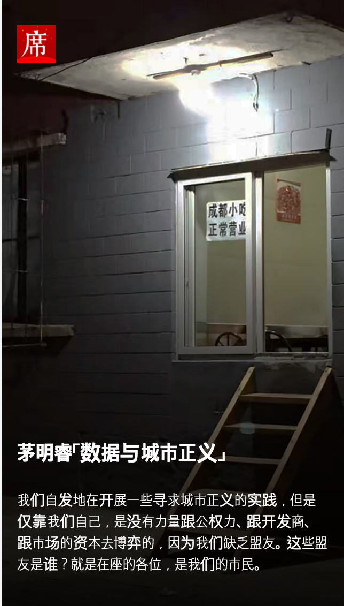
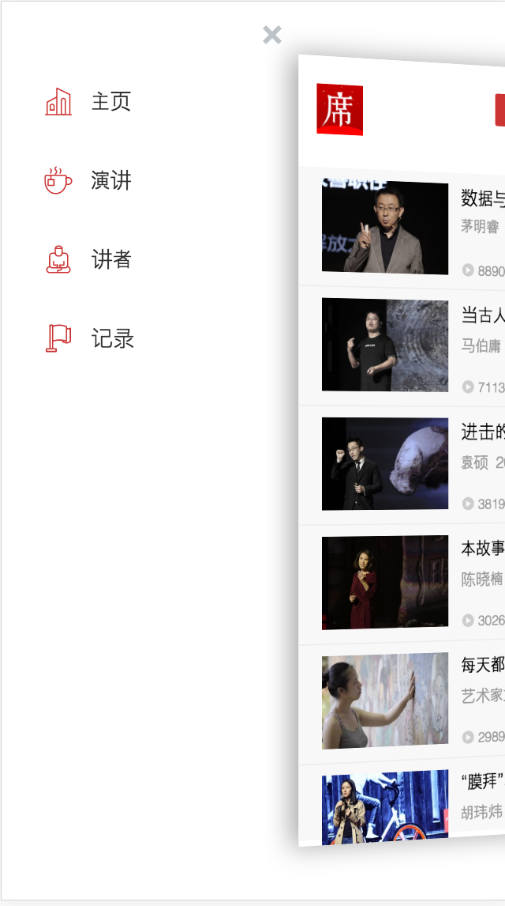

# YIXI

使用create-react-app 进行开发的[一席](http://yixi.tv]) app 的react 移植版本

## Dependencies

 1. [react-burger-menu](https://github.com/negomi/react-burger-menu) 用于模拟一席app 侧滑菜单效果
 2. [react-id-swiper](https://github.com/kidjp85/react-id-swiper) 用于整屏滑动
 3. [react-router-component](https://github.com/strml/react-router-component) 作为全局路由
 4. [react-loading](https://github.com/fakiolinho/react-loading) 用于加载动画（可选颜色）

## Captures

  
  
